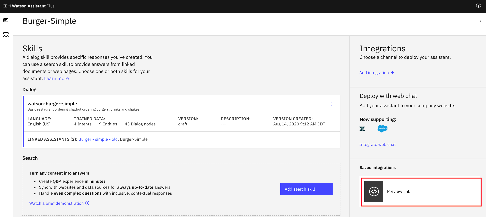
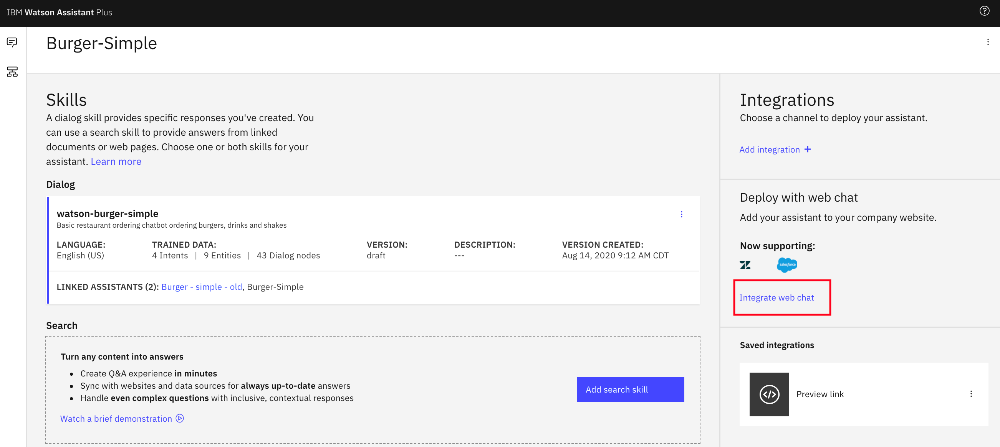
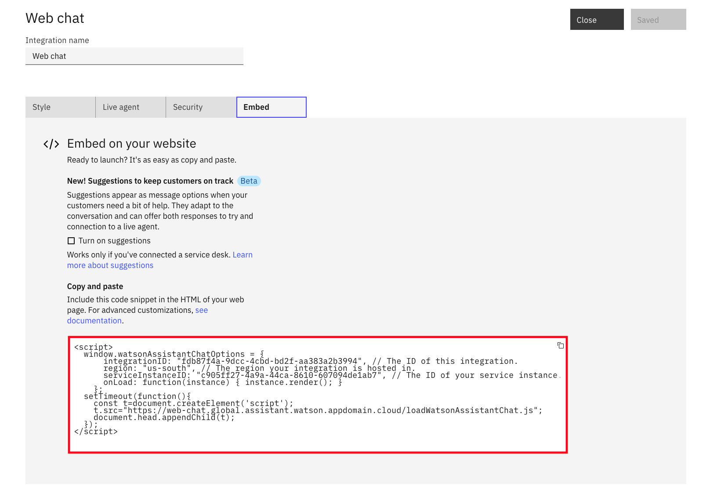

# Basic Burger Ordering Chatbot with Watson Assistant Service

In this repo, you are going to use the basic Watson Assistant features to build a chatbot for ordering burgers, drinks and etc. By having a casual conversation, Watson Natural Language Understanding(NLU) and Watson Natural Language Processing(NLP) capabilities embeded in Watson Assistant service help you effectively understand what your customer want to order, such as type of burgers, size of drinks, dine-in or to-go, and so on.

You can have a simple chatbot up and running in no time. When you access the chatbot on a mobile device, the built-in voice input supports verbal data entry which can greatly enhance the user experience.

After you complete the exercise, you will understand how to:

* Build Watson Assistant components
    - Intents
    - Entities
    - Dialog
* Create a simple chatbot that can be deployed locally, in IBM Clod Foundry, IBM Kubernetes Service and OpenShift.
* Via this simple chatbot, you can exchange information similar to text messaging.

This repo is part of Watson chatbot serial. The entire serial includes
* Simple ChatBot
* Dressed-up ChatBot
* Voice-Enabled ChatBot
* VoiceBot – Call and speak to ChatBot

> **NOTE**: Watson Assistant service is available in IBM Cloud as well as part of IBM Cloud pak for Data. As the result, you can deploy and run your chatbot in public cloud, private cloud, hybird cloud and on-prem.

> Click [here](https://www.ibm.com/products/cloud-pak-for-data) for more information about IBM Cloud Pak for Data.

Adopted from IBM code pattern [Creating a pizza ordering chatbot using Watson Assistant slots feature](https://github.com/IBM/watson-assistant-slots-intro).


## Flow

1. User sends messages to the application (running locally or on IBM Cloud).
2. The application sends the user message to IBM Watson Assistant service, and displays the ongoing chat in a web page.
3. Watson Assistant uses the NLU and NLP to understand and fulfill your order, and sends requests for additional information back to the running application. Watson Assistant can be provisioned on either IBM Cloud or IBM Cloud Pak for Data.


## Included Components

* [IBM Watson Assistant](https://www.ibm.com/cloud/watson-assistant/): Build, test and deploy a bot or virtual agent across mobile devices, messaging platforms, or even on a physical robot.


## Featured technologies

* [Node.js](https://nodejs.org/): An asynchronous event driven JavaScript runtime, designed to build scalable applications.


## Deploying a Sample Application

To deploy a sample application showing how to use `Watson Assistant` APIs,

<!--
|   |   |   |   |
| - | - | - | - |
| [](doc/source/cf.md) | [](doc/source/iks.md) | [](doc/source/openshift.md) | [](doc/source/local.md) |
-->

|   |   |   |   |
| - | - | - | - |
|  |  |  | [](doc/source/local.md) |


## Creating an Assistant

The `assistant` is a fully hosted chatbot that is managed by IBM Cloud. It frees you from worrying about deploying and maintaining infrastructure to support the bot. It prrovides an alternative to host a chatbot without any programming.

An assistant is a cognitive bot that you can customize for your business needs, and deploy across multiple channels to bring help to your customers where and when they need it. Skills An assistant routes your customer queries to a skill, which then provides the appropriate response. 

### Dialog skill

A `dialog skill` can understand and address questions or requests that your customers typically need help with. You provide information about the subjects or tasks your users ask about, and how they ask about them, and the product dynamically builds a machine learning model that is tailored to understand the same and similar user requests.

A sample burger-ordering `dialog skill` was imported to your `Watson Assistant` service instance when you deployed and run the sample application locally.

### Search skill

A search skill leverages information from existing corporate knowledge bases or other collections of content authored by subject matter experts to address unanticipated or more nuanced customer inquiries.

>Note: Search skill is available to Plus or Premiums plan only.

### Creating an Assistant

To create an `assistant`,

1. Login to [IBM Cloud](https://cloud.ibm.com).

1. On the dashboard, find and open your `Watson Assistant` service instance.

1. Click on `Launch Watson Assistant` on the `Manage` tab.

1. Select the `Assistants` tab in the left navigation tab.

1. Click `Create assistant`.

1. Enter a name, for example `Burger-Simple`.

1. Make sure that the `Enable the preview` checkbox is selected.

1. Click `Create assistant`.

1. Select `Add dialog skill`.

1. Select `watson-burger-simple` skill.



1. Click `Preview link`.


1. Click the link under the section `Try it out and share the link` to show the chatbot on a sample web site.


1. You should have a chatbot similar to the one when you tested in the sample application. Communicate with the chatbot and place orders. It works the same.


## Access the Chatbot from Existing Web Site

Add your assistant to your company website as a web chat widget that can help your customers with common questions and tasks, and can transfer customers to human agents.

When you create a web chat integration, code is generated that calls a script that is written in JavaScript. The script instantiates a unique instance of your assistant. You can then copy and paste the HTML script element into any page or pages on your website where you want users to be able to ask your assistant for help.

>Note: This integration is available to Plus or Premium plan users only.

1. Login to [IBM Cloud](https://cloud.ibm.com).

1. On the dashboard, find and open your `Watson Assistant` service instance.

1. Click on `Launch Watson Assistant` on the `Manage` tab.

1. Select the `Assistants` tab in the left navigation tab.

1. Select `Burger-Simple`.



1. Click `Integrated web chat` link.

1. Click `Create`.

1. Navigate to `Embed` tab.



1. When you create a web chat integration, code is generated that calls a script that is written in JavaScript. The script instantiates a unique instance of your assistant. You can then copy and paste the HTML script element into any page or pages on your website where you want users to be able to ask your assistant for help.

1. Copy the script.

1. Open file `sample_homepage.html` in a file editor. The file locates in the root folder of the downloaded repo. This sample HTML file is used to similate a company web page.

1. Past the script under the section `<!-- copied script elements -->`. 

    ```
    <html>
    <head>My web site</head>
        <body>
            <title>My Test Page</title>
            <H1>Welcome to my home page</H1> 
            <!-- <p>Welcome to my home page</p> -->
            
            <!-- copied script elements -->
            <script>
                window.watsonAssistantChatOptions = {
                    integrationID: "fdb87f4a-9dcc-4cbd-bd2f-aa383a2b3994", // The ID of this integration.
                    region: "us-south", // The region your integration is hosted in.
                    serviceInstanceID: "c905ff27-4a9a-44ca-8610-607094de1ab7", // The ID of your service instance.
                    onLoad: function(instance) { instance.render(); }
                };
                setTimeout(function(){
                const t=document.createElement('script');
                t.src="https://web-chat.global.assistant.watson.appdomain.cloud/loadWatsonAssistantChat.js";
                document.head.appendChild(t);
                });
            </script>        

        </body>
    </html>

    ```

1. Save the changes.

1. Open the file `sample_homepage.html` in a browser.

1. The chatbot widget is embeded at the bottom-right corner of the web page.


1. The chatbot widget is expanded when you click on it. The chatbot window appears on the web page.


## Modifying the Sample Dialog Skills

A sample burger-ordering `dialog skill` was imported to your `Watson Assistant` service instance when you deployed and run the sample application locally. You are going to modify the sample skill slightly to help you understand how the chatbot works.


## License

This code pattern is licensed under the Apache Software License, Version 2.  Separate third party code objects invoked within this code pattern are licensed by their respective providers pursuant to their own separate licenses. Contributions are subject to the [Developer Certificate of Origin, Version 1.1 (DCO)](https://developercertificate.org/) and the [Apache Software License, Version 2](https://www.apache.org/licenses/LICENSE-2.0.txt).

[Apache Software License (ASL) FAQ](https://www.apache.org/foundation/license-faq.html#WhatDoesItMEAN)

## Links

* [Demo on youtube](https://youtu.be/6QlAnqSiWvo)
* [IBM Watson Assistant Docs](https://cloud.ibm.com/docs/services/conversation/dialog-build.html#dialog-build)
* [Blog for IBM Watson Assistant Slots Code Pattern](https://developer.ibm.com/code/2017/09/19/managing-resources-efficiently-watson-conversation-slots/)

## Learn more

* **Artificial Intelligence Code Patterns**: Enjoyed this Code Pattern? Check out our other [AI Code Patterns](https://developer.ibm.com/technologies/artificial-intelligence/).
* **AI and Data Code Pattern Playlist**: Bookmark our [playlist](https://www.youtube.com/playlist?list=PLzUbsvIyrNfknNewObx5N7uGZ5FKH0Fde) with all of our Code Pattern videos
* **With Watson**: Want to take your Watson app to the next level? Looking to utilize Watson Brand assets? [Join the With Watson program](https://www.ibm.com/watson/with-watson/) to leverage exclusive brand, marketing, and tech resources to amplify and accelerate your Watson embedded commercial solution.
* **Kubernetes on IBM Cloud**: Deliver your apps with the combined the power of [Kubernetes and Docker on IBM Cloud](https://www.ibm.com/cloud/container-service)
